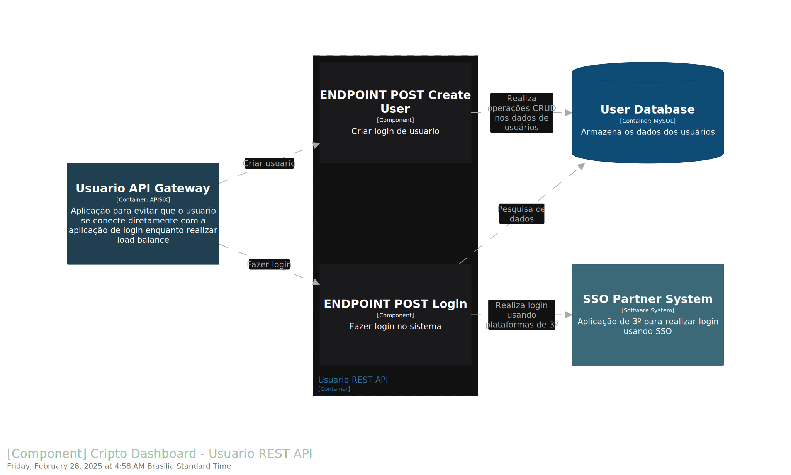

# Projeto de Dashboard para Criptomoedas

## Descrição
Este projeto é uma aplicação de dashboard para gerenciamento de criptomoedas, permitindo a visualização e manipulação de dados em tempo real de diversas moedas digitais. Utiliza NestJS como backend, TypeORM para gerenciar o acesso ao banco de dados e está implementado com integração a APIs externas para atualização contínua das informações.

## Funcionalidades
- **Visualização de Moedas:** Veja detalhes de criptomoedas, como símbolo, imagem, nome completo, e outras informações relevantes.
- **Atualização Automática:** Cronjobs configurados para atualizar os dados das moedas a cada 24 horas.
- **Filtragem Dinâmica:** Filtros que permitem busca dinâmica pelo símbolo das moedas.
- **Estrutura Modular:** Código organizado em módulos, controladores e serviços para facilitar a manutenção e expansão.

## Tecnologias Utilizadas
- **NestJS:** Framework para construção de aplicações server-side eficientes, escaláveis e mantíveis.
- **TypeORM:** ORM para bancos de dados, permitindo fácil integração e manipulação dos dados.
- **Docker:** Containerização da aplicação para facilitar a execução em diferentes ambientes.
- **APIs de Terceiros:** Integração com APIs para obter dados em tempo real das criptomoedas.

## Estrutura do Projeto
O projeto segue uma estrutura modular, dividida em módulos de funcionalidades específicas, garantindo melhor organização e facilidade de manutenção.

## C4 Model documentation:
- **System Context**

- **Cripto Dashboard Container**

- **Cripto Dashboard REST API Component**

- **Cripto Usuario REST API Component**

